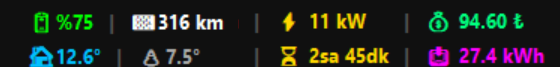

# 🏎️ Tesla Ultimate Desktop Widget

Tesla'nızın şarj durumunu, menzilini, sıcaklığını ve güvenlik uyarılarını masaüstünüzden anlık olarak takip edin. Bu widget, **TeslaMate** verilerini MQTT üzerinden çekerek çalışır.

## ✨ Özellikler
- 🔋 **Anlık Pil & Menzil:** Kalan yüzde ve tahmini menzil.
- 🏠 **İç & Dış Sıcaklık:** Aracın iç ve dış ısısı.
- ⚡ **Şarj Paneli:** Şarj olurken otomatik açılır; güç (kW), maliyet (₺), süre ve eklenen enerji (kWh) bilgilerini gösterir.
- 🚨 **Bildirim:** Araç şarjı dolduğunda veya kilitli araçta kapı açıldığında masaüstü bildirimi gönderir.
- 💰 **Maliyet Hesaplama:** Elektrik birim fiyatına göre dolum maliyetini gösterir.

## 🚀 Kurulum ve Çalıştırma

Bu proje iki parçadan oluşur:
1. **Backend (Docker):** Verileri çeken TeslaMate sistemi.
2. **Frontend (Python):** Masaüstü widget'ı.

### Adım 1: Ön Hazırlık
- [Docker Desktop](https://www.docker.com/products/docker-desktop/)'ı indirip kurun.
- [Python](https://www.python.org/downloads/)'ı (3.9 veya üzeri) indirip kurun (Kurarken "Add to PATH" seçeneğini işaretlemeyi unutmayın).

### Adım 2: Backend Sistemini Başlatın
Proje klasöründe terminal açın ve şu komutu çalıştırın:

docker-compose up -d
Bu komut veritabanını ve MQTT sunucusunu arka planda başlatır.

### Adım 3: Widget Kurulumu
Aynı terminalde Python kütüphanelerini yükleyin:

pip install -r requirements.txt

### Adım 4: Aracınızı Bağlayın (TeslaMate Ayarı)
Tarayıcınızdan http://localhost:4000 adresine gidin.

Tesla hesabınızla giriş yapın 
Token Alın: Access Token Generator for Tesla eklentisini kurun (https://chromewebstore.google.com/detail/access-token-generator-fo/djpjpanpjaimfjalnpkppkjiedmgpjpe).
Eklenti üzerinden Tesla hesabınızla giriş yaparak Access ve Refresh kodlarınızı alın.
Settings kısmından Streaming API seçeneğini Enabled yapın.

### Adım 5: Widget'ı Çalıştırın 🏁
Artık teslax.py dosyasına çift tıklayarak veya terminalden şu komutla widget'ı başlatabilirsiniz:

python teslax.py

### 📊 Ekstra Özellikler
Grafana Paneli: Şarj geçmişi ve batarya sağlığı için http://localhost:3000 (Kullanıcı: admin, Şifre: admin veya docker-compose dosyasındaki şifre).

### Ayar Değişikliği: Elektrik birim fiyatını değiştirmek için teslax.py dosyasını açıp ELECTRICITY_PRICE değerini düzenleyebilirsiniz.
Eğer konumunu değiştirmek isterseniz de KONUM AYARI bölümünden değiştirebilirsiniz.

Kullanım İpuçları Kapatma: Widget üzerine çift tıklayarak uygulamayı sonlandırabilirsiniz.
Veri Gelmiyorsa: Aracın uyanması için telefon uygulamasından bir kez kilidi aç-kapat yapmanız yeterlidir.
Uygulamayı Başka zamanda kullanmak için docker programını çalıştırıp teslax.py dosyasına çift tıklayınca yine sol altta açılıyor.

### ⚠️ Not
Bu proje açık kaynaklı TeslaMate projesini kullanır. Verileriniz sadece kendi bilgisayarınızda saklanır.

